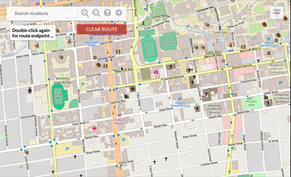
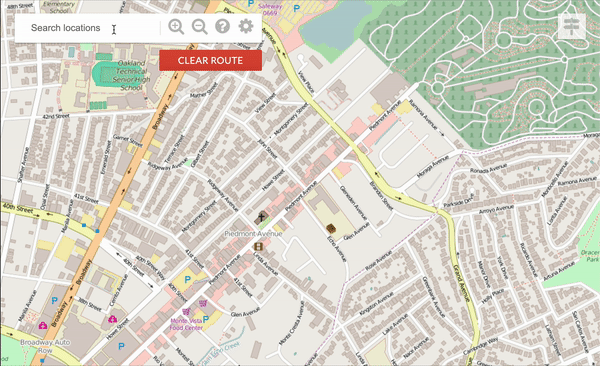

# Bear Map Project

This project is my implementation of the backend web server for the final project of UC Berkely's CS61B, Spring 2018. It was originally inspired by the [Open Street Map](https://wiki.openstreetmap.org/wiki/Main_Page) project from where the map data was downloaded utilized. This project is an ongoing project of mine, and it is currently being developed as a hobby project which I am continually refactoring, and making refinements to.

## Underlying Data Structres

| Function | Data Structure |
| -- | -- |
| [Map Rastering](#Rasterisation) | None, pure math </br>Alternative: Quad-tree Implementation, optimized for vectored graph (**to be implemented**) |
| [Graph Building](#Graph-Building) | HashMap |
| [Routing](#Routing) | Heap (Min Priority Queue)</br>HashMap </br>KD-Tree: Log time Node search (**to be implemented, currently linear time**)|
| [Auto Complete & Searching](#Auto-Complete) | Trie (Retrieval Tree)</br>HashMap</br>Priority Queue |

## File Structures

The project structure is refactored partially in reference to the structure of CS61B 2019 project c.

```file structure
bear-map
├── src
│   ├── main
│   │   └── java
│   │       ├── MapServer.java
│   │       ├── ServerInitializer.java
│   │       ├── controller      // Routes
│   │       │   ├── RouteHandler.java
│   │       │   ├── RouteHandlerBuilder.java
│   │       │   └── impl
│   │       │       ├── ClearRouteHandler.java
│   │       │       ├── RasterHandler.java
│   │       │       ├── RedirectHandler.java
│   │       │       ├── RouterHandler.java
│   │       │       └── SearchHandler.java
│   │       ├── service         // Business Logics
│   │       │   ├── GraphBuildingHandler.java
│   │       │   ├── GraphDB.java
│   │       │   ├── Rasterer.java
│   │       │   └── Router.java
│   │       └── utils           // Utility Functions
│   │           ├── Constants.java
│   │           ├── ImageToOutputStreamWriter.java
│   │           ├── RouteHandlerFactory.java
│   │           ├── TextFormatter.java
│   │           └── dataStructures
│   │               ├── Tuple.java
│   │               ├── priorityQueue
│   │               │   ├── ArrayHeapMinPQ.java
│   │               │   └── ExtrinsicMinPQ.java
│   │               └── trie
│   │                   ├── Trie.java
│   │                   └── TrieSet.java
│   ├── static
│   │   └── page
│   │       ├── map.html
│   │       ├── marker.gif
│   │       ├── round_marker.gif
│   │       ├── scripts
│   │       │   └── map.js
│   │       └── styles
│   │           └── map.css
...
```

## Running the Application Locally

| Requirements |
| --|
| [JDK 1.8 or above](https://www.oracle.com/au/java/technologies/javase-downloads.html) |
| [Apache Maven](https://maven.apache.org/download.cgi) |

</br>

* Download the [project](https://github.com/JunlinDu/bear-map.git) and the [project dataset](https://github.com/JunlinDu/library), place them into a directory structured as indicated below:

```file structure
opt
├── bear-map        -- project directory
└── library         -- dataset directory
```

* From the command line, change the working directory to the project root directory ```/bear-map```, and compile the project

```shell
mvn compile
```

* Runing the map server:

```shell
mvn exec:java -Dexec.mainClass="MapServer"
```

* Once the server has started, open your web browser and access port 4567 on localhost by typing in ```localhost:4567``` to the browser.

✅ Access using Chrome to have best experience. Zoom out may not work on Firefox and Safari.

## Rasterisation

Rasterisation is essentially what allows the visual information (images) to be presented to the user, so that users can see the map, and are able to navigate around, zoom in and zoom out on the map. </br>
The process of rasterisation is achieved by ```service.Rasterer.java```. service.Rasterer takes the user's request from the browser, which requests a certian region of the world, and constructs from a group of small images a large image that covers the region that is apporiate to what is being requested. It is also the rasterer's resposibility to provide an image that covers correct distance per pixel (LonDPP) to satisfy the user's visual demand when viewed from a certian zoom level.

| Name | Function |
| -- | -- |
| [Rasterer](src/main/java/service/Rasterer.java) | Performs Rasterisation |

**Rastering result preview**</br>


## Graph Building

Graph building builds a in-memory represention of the graph which allows me as a programmer being able to interact with and manipulate the map. This serves as the foundation for features such as routing and searching. The dataset used for graph building is in the [OSM XML](https://wiki.openstreetmap.org/wiki/OSM_XML) format. The OSM XML dataset contains large, complex real-world mapping data, most of which (not all) are utilized, which are enough to enable major functionalities to be achieved in this project. </br>

An industry-strength XML praser, [SAX Parser](https://docs.oracle.com/javase/tutorial/jaxp/sax/parsing.html), is used in the application for parsing the XML file. Below are key XML tags in the XML file:

| Name | Description |
| -- | -- |
| [\<node>](https://wiki.openstreetmap.org/wiki/Node) | A node defines a single point in space which has an **id**, **longitude**, and **latitude**. All of which are essential for path searching. |
| [\<way>](https://wiki.openstreetmap.org/wiki/Way) | A way is a sequence of nodes that are related in certain ways, which can represent a street or an area. The graph building in the application is mainly concered with the road versions of ways. They are used for constructing edges in the graph. |
| [\<relation>](https://wiki.openstreetmap.org/wiki/Relation) | Relations are not used, it is beyond the scope of this project |
</br>

Since the OpenStreetMap OSM XML dataset is not 100% accurate in terms of marking one-ways and speed limits, they are disregarded and not implemented in the application. The  dataset was downloaded from [BBBike's free download server](https://download.bbbike.org/osm/).

| Name | Function |
| -- | -- |
| [GraphBuildingHandler](src/main/java/utils/GraphBuildingHandler.java) | Prase the OSM XML file and load the presistent data into memory |
| [GraphDB](src/main/java/service/GraphDB.java) | The in-memory representation of the graph represneting the map, used for routing and auto complete |

## Routing

Routing allows users to find the best route between two points on the map. Users can click on the map to set a starting point, and then click on another point to set an endpoint, which will trigger the formation of the shortest path, highlighted in blue, between these two points. </br>
Routing takes directional factors in to account to bias the dijkstra's algorithm (i.e. A* Algorithm) to allow better performance. This is to address the problems with dijkstra's algorithm when working with real-world mapping dataset. Although dijkstra's algorithm is guaranteed to give a "perfect" path every time when routing is performed by looking at each node, when such operation is performed on two points that encompass a larger geographical area, the amount of nodes need to be examined is potentially very large, cosuming great amount computing resources. </br>
Taking directional factors in to account can drastically decrease the amount of nodes that need to be exmained thus significanlly improves the performance. For example, when the two points form a vector which points eastward, nodes on the east side will be given higher priorities, so that the Djikstra's algorithm is biased towards east. While this change might sometimes reuslt in a path that is not the shortest possible path between two given points, the drastic difference in routing time and a "good enough" path are usually what real-world users need.

**Things to be implemented:**

- [ ] Currently when the user clicks on a point on the map, the map holding all the nodes will be traversed to retrieve the nearest node from the requested point. This takes linear time. A better solution would be using a KD-Tree to store the graph for log time nearset node searching.</br>

| Name | Function |
| -- | -- |
| [Router](src/main/java/service/Router.java) | Performs routing and providing driving directions |
| [ArrayHeapMinPQ](src/main/java/utils/dataStructures/priorityQueue/ArrayHeapMinPQ.java) | The Min Priority Queue used for performing A* algorithm, and used for auto complete optimization |
| [ExtrinsicMinPQ](src/main/java/utils/dataStructures/priorityQueue/ExtrinsicMinPQ.java) | Interface of the min Priority Queue |

**Routing Preview**</br>


**Driving Directions Preview**</br>
The application will also give a driving direction based on the shortest path given by the router.</br>

- [ ] **Fix Required:** Driving direction tests has not fully passed, need to use vector to determine the turning direction.



## Auto Complete

The Auto Complete feature is similar to that of Google's input bar, which will give the user a list of suggestions based on what they typed in the input field. The underlying data structure used for this feature is a retrieval tree (Trie), which is commonly used for fast string prefix matching. </b>
The problem with a generic Trie is that in the real world, if the user inputs a short string, for example, "ca", the number of strings mathed with this prefixed will be too big to process (potentially billions). Therefore the generic Trie needs to be modified for it to be able to produce a list of "best results" of apporiate size.

**Things to be implemented:**

- [ ] Searching of nodes.
- [ ] As mentioned in issue #7

| Name | Function |
| -- | -- |
| [Trie](src/main/java/utils/dataStructures/trie/Trie.java) | The Retrieval tree, used for string prefix maching |
| [TrieSet](src/main/java/utils/dataStructures/trie/TrieSet.java) | The interface of the retrieval tree |

**Auto Complete Preview**</br>


## Deployment
